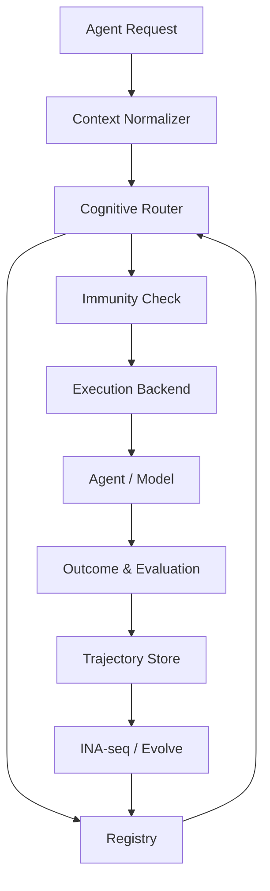

[返回文档矩阵](../00-文档矩阵与阅读路径.md)

# 系统架构与模块边界

## 1. 架构目标

首轮架构不以完整产品为目标，而以以下能力为中心：

- 表示可独立；
- 执行 Backend 可替换；
- 实验可复现；
- 轨迹与谱系可追溯；
- 市场和私有部署能力不被未来架构堵死。

## 2. 逻辑模块

```text
ina-schema
  Schema、校验、版本兼容

ina-registry
  Artifact、版本、权限、许可和状态

ina-trajectory
  Agent 调用、轨迹、结果和反馈记录

ina-seq
  候选 cognition 提取

ina-router
  上下文匹配、激活和冲突预判

ina-runtime
  运行时注入、策略执行和审计

ina-compiler
  Prompt / SFT / DPO / Neural 编译

ina-eval
  Benchmark、基线、运行与统计

ina-evolve
  归因、Mutation、Replay 和回滚

ina-lineage
  继承、差异、派生和撤销

ina-graft
  冲突解析与语义组合

ina-immunity
  Framing、谄媚、污染和偏误检测
```

## 3. 控制面与数据面

### 控制面

负责：

- INA 创建、版本和状态；
- 许可与权限；
- 评价契约；
- 发布、撤销和回滚；
- 谱系和 Graft；
- 企业策略。

### 数据面

负责：

- Agent 请求；
- Router；
- Runtime；
- Prompt / Policy 注入；
- 执行日志；
- 结果和反馈。

端侧部署可以只携带 Compiled INA 和必要的本地控制面子集。

## 4. 高层流程



## 5. 核心实体

- `AgentRequest`
- `Trajectory`
- `DecisionPoint`
- `INAArtifact`
- `INARelease`
- `Activation`
- `Compilation`
- `EvaluationRun`
- `Outcome`
- `Mutation`
- `LineageEdge`
- `License`
- `Revocation`

## 6. 推荐仓库结构

```text
/
├── 文档/
├── packages/
│   ├── schema/
│   ├── runtime/
│   ├── router/
│   ├── compiler/
│   ├── eval/
│   └── sdk/
├── services/
│   ├── registry/
│   ├── trajectory/
│   ├── sequencer/
│   └── evolution/
├── datasets/
│   ├── benchmarks/
│   ├── demonstrations/
│   └── replay/
├── experiments/
└── examples/
```

这是逻辑建议，不代表当前必须采用 Monorepo。

## 7. 模块边界原则

- Schema 不依赖具体模型 SDK；
- Runtime 不拥有 Artifact 的最终版本状态；
- Compiler 输出必须可追溯到源 INA；
- Eval 不依赖单一裁判模型；
- Evolution 不能绕过评价契约；
- Registry 不直接推断 cognition；
- Market 元数据不能污染执行语义；
- 端侧 Runtime 能在云端不可用时执行已授权 INA。

## 8. 隐私和企业部署预留

从第一版起区分：

- Public INA；
- Private User INA；
- Team INA；
- Enterprise Restricted INA；
- Air-gapped Compiled INA。

轨迹默认不因购买或交易而共享。交易的是认知适配器及其许可，不是原始私人对话。
