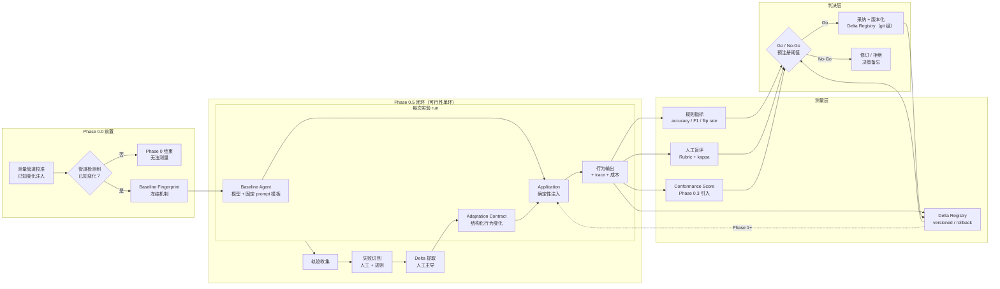
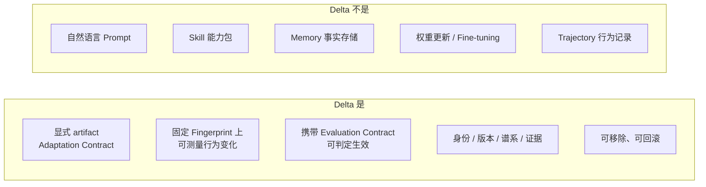

# Phase 0 Architecture Diagram

> 本图描述 **Phase 0 实验架构**，不是产品架构。每个方框都对应一个可运行脚本或一份数据文件。

## 1. 总体实验环



## 2. Delta 是什么 / 不是什么



## 3. 组件与 Phase 0 代码边界

| 组件 | Phase 0 形态 | 允许的代码 | 禁止的代码 |
|---|---|---|---|
| Baseline Agent | 单模型 + 固定 prompt 模板 | run 脚本 | Harness 开发 |
| Delta Artifact | YAML / JSON Adaptation Contract | schema 校验脚本 | Schema 编译器 |
| Application | 确定性注入（同模板追加结构化块） | 注入函数 | 服务 |
| Measurement | 指标计算脚本 + 分析 notebook | Python 脚本 | Dashboard |
| Registry | git 目录 + 文件命名约定 | 文件约定 | 数据库服务 |
| Loop | 人工主导提取 + 脚本辅助 | 提取辅助脚本 | 自动 Evolution 系统 |

## 4. 数据流约定

```text
experiments/phase-0.X-*/data/     ← 数据集（JSONL + annotation 协议）
experiments/phase-0.X-*/runs/     ← 每次 run 的输出 + Fingerprint 快照
experiments/phase-0.X-*/analysis/ ← 指标计算、图表、决策备忘
```

任何 run 必须包含：`baseline_fingerprint.yaml` + 输入输出 JSONL + 所用 Delta 的 hash（文档 14 第 2 节）。